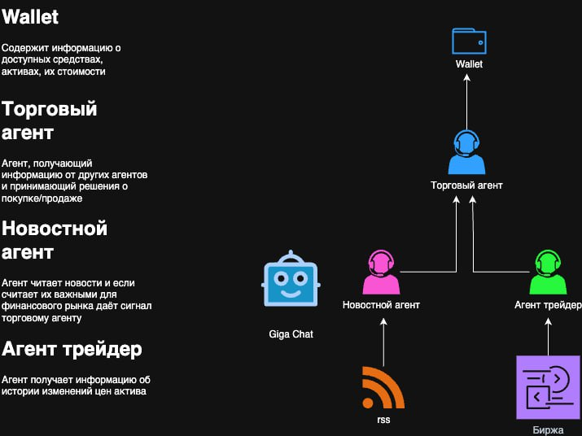

# Агент-Трейдер

## 📚 Описание проекта

Этот проект представляет собой мультиагентную систему с четырьмя ключевыми компонентами:

1. **Wallet**  
   Содержит информацию о доступных средствах пользователя и текущем составе портфеля (акции, облигации и прочие инструменты).

2. **Новостной агент**  
   - Получает ленты новостей (RSS).  
   - Анализирует тексты с помощью Giga Chat (LLM).  
   - При обнаружении значимых для рынка сигналов отправляет их Торговому агенту.

3. **Агент трейдер**  
   - Запрашивает исторические данные об изменении цен активов с Биржи.  
   - Генерирует технические сигналы (например, на основе фигур двойного толкования).

4. **Торговый агент**  
   - Интегрирует сигналы от Новостного агента и Агента трейдера.  
   - Принимает решения о покупке/продаже.  
   - Через Wallet осуществляет фактические операции с активами.



## 💻 Использование

Проект реализован в виде веб-интерфейса с имитированным инвестиционным портфелем пользователя

- **Баланс кошелька** — текущее состояние доступных средств  
- **Состав портфеля** — список приобретённых активов и их актуальная стоимость  
- **Прибыль/Убыток** — общий P&L и по каждой позиции  
- **Последние мысли агента** — логи решений, обоснования сигналов и рекомендаций  

## Описание
Это небольшой демонстрационный стек, в котором четыре контейнера образуют законченный торговый «конвейер». На самом дне работает Postgres – обычная база данных, куда складываются сделки и результаты анализа новостей. Перед ней стоит тонкий шлюз MCP Alchemy: это сервис FastAPI, принимающий HTTP-запросы `/v1/query` и `/v1/execute`, преобразующий их в SQL и передающий внутрь Postgres. Благодаря MCP торговому агенту не нужны драйверы БД и долгие блокирующие подключения: всё сводится к короткому запросу по HTTP.

Основная логика живёт в контейнере agent. Внутри него крутится граф LangGraph. Каждые сорок пять секунд асинхронный узел `get_prices` запрашивает через ccxt актуальные цены восьми самых ликвидных пар на Binance и передаёт их следующему узлу. `calc_tech` по этим же парам загружает свечи 5-минутного тайм-фрейма, считает SMA, EMA, MACD, RSI и полосы Боллинджера и превращает всё в одну сводную оценку «силы» от –1 до +1. Параллельно узел `parse_news` получает из БД свежие новости, которые заранее подготовил отдельный слушатель RSS. Когда новости, техника и цены сходятся, управление передаётся LLM-узлу.

LLM-узел формирует промпт: в начале системная инструкция («верни только JSON-массив приказов»), затем блок с ценами, блок с техсигналами и блок с новостями. Получив ответ от OpenRouter, скрипт пробует дважды извлечь из него корректный JSON; если удаётся, выполняет указанные BUY, SELL или HOLD. Если же модель возвращает пустую или повреждённую строку, граф автоматически переключается на deterministic-алгоритм, который принимает решение по правилу «техника плюс новости». Все приказы проходят через кошелёк – объект-single­ton, который знает текущий кэш, открытые позиции и последний момент операции по каждому активу. Кошелёк отсекает сделки, превышающие лимиты на размер и частоту, рассчитывает плату биржи, фиксирует P\&L и отправляет запись в таблицу `trades` через MCP.

Пока граф работает, Streamlit-приложение показывает в браузере баланс, кривую equity, список последних сделок и карточку событий графа. Интерфейс обновляется тем же циклом, так что картинка живёт в реальном времени.

В отдельном контейнере крутится `rss_listener.py`. Он периодически загружает RSS-ленты крупных крипто-СМИ, вытягивает из статей чистый текст, отправляет его в LLM для определения актива, тональности и уверенности, а потом складывает результат в `news_llm_cache`. Агент, получая этот кэш, видит новости как структурированные «сигналы» и учитывает их при торговом решении.

Чтобы запустить всю систему, достаточно положить файл `.env` с ключом `OPENROUTER_API_KEY` в корневую директорию проекта и выполнить одну команду `docker compose up --build -d`. Compose соберёт образ агента и образ MCP, поднимет Postgres, запустит слушатель RSS и сам торговый агент. После старта дашборд будет доступен на `http://localhost:8501`, MCP – на `http://localhost:8081`, а Postgres – на порту 5433 хоста. Остановить стек можно обычной командой `docker compose down`.

## Запуск
```bash
git clone 

docker compose up --build -d # сборка и старт 4 сервисов
```
##  Проверочные запросы
```bash
# последние новости
curl -s -X POST http://localhost:8081/v1/query \
 -H 'Content-Type: application/json' \
 -d '{"query":"SELECT asset,sentiment,confidence FROM news_llm_cache ORDER BY created_at DESC LIMIT 3;"}' | jq

# P&L по сделкам
curl -s -X POST http://localhost:8081/v1/query \
 -H 'Content-Type: application/json' \
 -d '{"query":"SELECT side, SUM(realized_pnl) FROM trades GROUP BY side;"}' | jq
```

## Замечания
В проекте был использован MCP сервер https://github.com/runekaagaard/mcp-alchemy